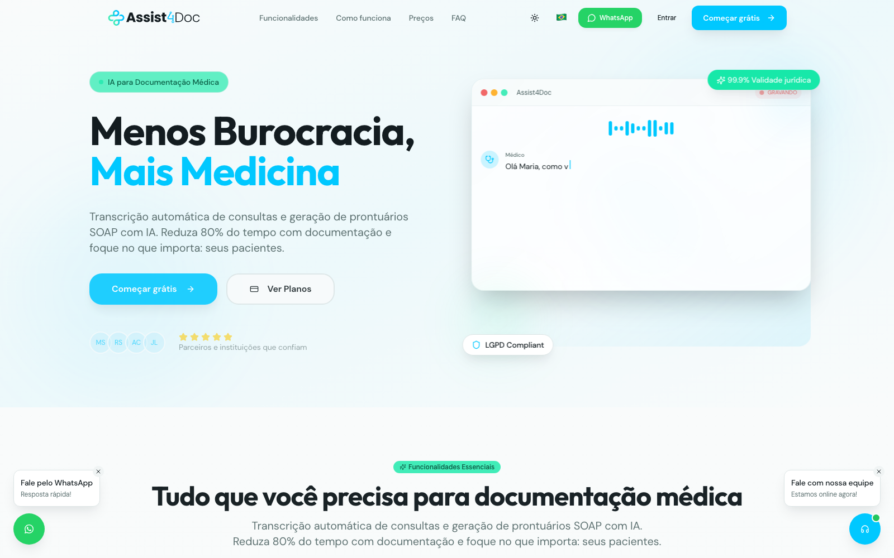
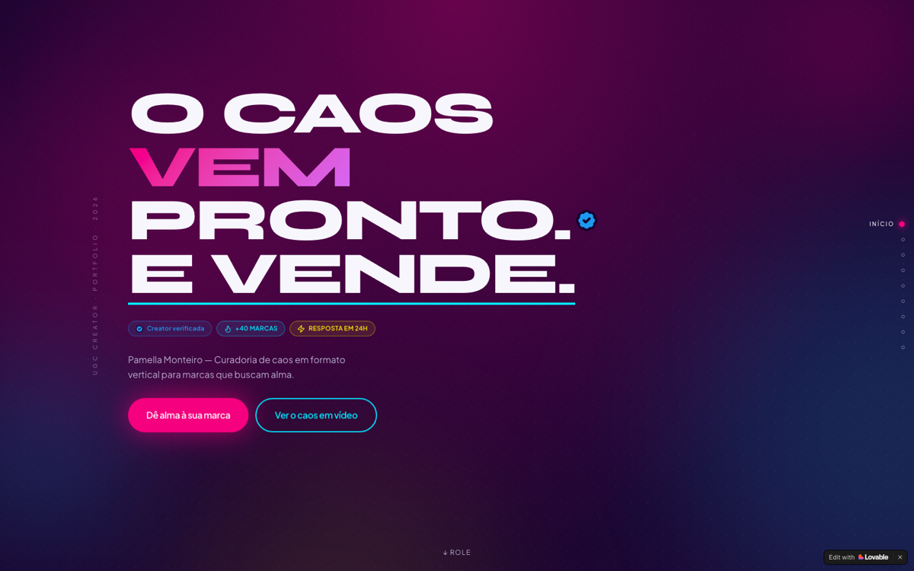
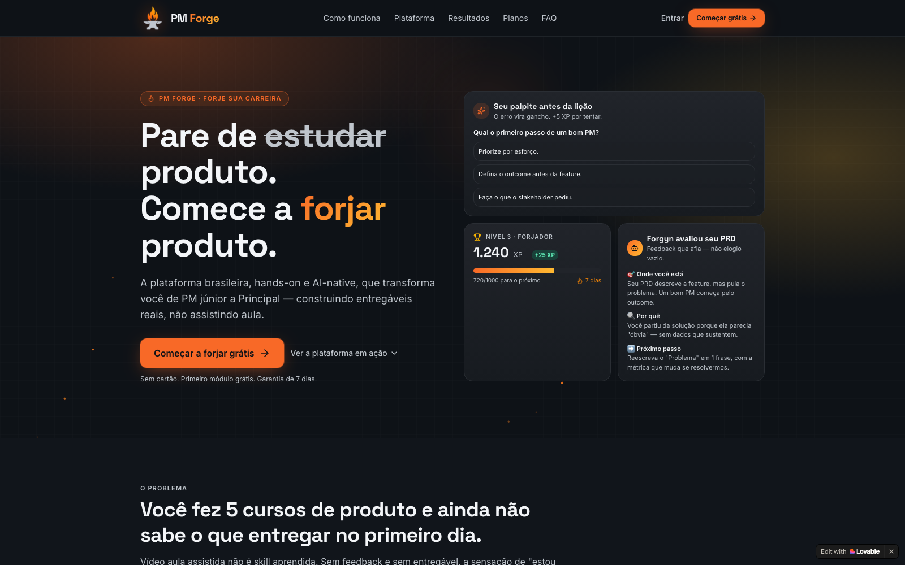
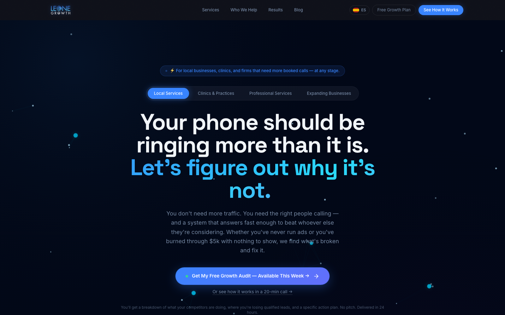

<!-- Language: 🇬🇧 English · 🇧🇷 Português → README.pt-BR.md (primary) · 🇪🇸 Español → README.es.md -->

# 🧭⚙️ Kleist Monteiro
### Innovation & AI Manager · AI Engineer · Founder

*I build AI in regulated domains — eval-first, fail-closed, **click-to-verify proof** (not slideware).*

[🇧🇷 Português](README.pt-BR.md) · **🇬🇧 English** · [🇪🇸 Español](README.es.md)

---

### ⏱️ Numbers in 30 seconds

| | | |
|---|---|---|
| **14** products built, each with a case study | **6** live on their own domains | **3** companies founded and operated from zero |
| **6** OSS modules in NoKey · **~39** automated tests | **59** specialized legal agents in Lastro | **3** languages in this portfolio (PT/EN/ES) |

*All verifiable: click the demos below or audit the [NoKey repo](https://github.com/kleislm/nokey). No invented revenue numbers — honest rule.*

### 🧭 Where to start (pick your track)

- **Recruiter** → [Numbers above](#️-numbers-in-30-seconds) · [Evidence map](about/competencies.md) · [Bio & thesis](about/bio.md)
- **Client / company** → [Live proof](#︎-live-proof-real--clickable) · [Innovation Playbook](innovation/playbook.md)
- **Founder / technical peer** → [Architecture patterns](engineering/architecture-patterns.md) · [Eval methodology](engineering/eval-methodology.md) · [NoKey](https://github.com/kleislm/nokey)

### ▶︎ Live proof (real — clickable)

| Product | Where | What you verify in 30s |
|---|---|---|
| **Assist4Doc** ⭐ | [assist4doc.com](https://assist4doc.com) | Record 10s · turns into a structured SOAP · physician must approve or nothing goes to the chart |
| **NoKey** (OSS) | [github.com/kleislm/nokey](https://github.com/kleislm/nokey) | Open any demo · DevTools → Network: **zero API calls** after the model loads |
| **Pamella's Hub** | [pamellamonteiro.com](https://pamellamonteiro.com) | Portfolio + CMS + LLM lead scoring |
| **Staff Forge** | [pmforge.com.br](https://pmforge.com.br) | Eval suite builder · LLM-as-judge · hands-on AI PM tools |
| **Lastro** ⭐ | (stealth) | See [`engineering/architecture-patterns.md`](engineering/architecture-patterns.md) — read why a brief with a fabricated case-law citation **never ships** |

## Why

AI innovation hides three things: **(1)** the manager only runs meetings and can't see ROI evaporate in latency and prompt rework; **(2)** the engineer only codes and can't see horizon 2/3 or governance; **(3)** almost no one has the regulatory fluency to put AI in healthcare, law, and finance without creating a liability.

I cover all three — and I prove it on `git push`.

## Selected work

| Product | The pain it kills 💔 | Horizon | AI stack | Live | Case |
|---|---|---|---|:--:|:--:|
| **Lastro** ⭐ | A legal brief with a fabricated case-law citation = professional liability | **H2** — new operating model for legal practice | LangGraph · verified RAG · multi-AI panel · OpenFGA | stealth | [📖](case-studies/lastro.md) |
| **Assist4Doc** ⭐ | Physicians lose 3h/day on charts; incomplete notes = clinical-legal risk | **H1** at scale — regulated productivity | STT + LLM grounding · human-in-the-loop · multi-tenant | [↗](https://assist4doc.com) | [📖](case-studies/assist4doc.md) |
| **NoKey** (OSS) | $$$ on paid APIs that are just *compute* | **H3** — platform optionality | transformers.js · WebGPU · faster-whisper · Playwright · pdf.js | [↗](https://github.com/kleislm/nokey) | [📖](case-studies/nokey.md) |
| **Pamella's Hub** | A creator with no CRM, losing leads she didn't even know were leads | **H1** — AI in B2C | LLM lead scoring · profile embeddings · headless CMS | [↗](https://pamellamonteiro.com) | [📖](case-studies/pamella-ai-hub.md) |
| **Staff Forge** | PMs moving into AI PM without hands-on practice | Capability building | LLM-as-judge · curated dataset · regression suite | [↗](https://pmforge.com.br) | [📖](case-studies/staff-forge.md) |

> **+9 products** in the [full index (14)](case-studies/_index.md): TCU Navigator · KLM Legal Hub · ConversaFlow · Insight Health · Agenda Connect · Leone · Desburocratize · OrdemXP · Modulazzi.

## Gallery — live screenshots

*Real captures from the live systems, not mockups.*

<table>
<tr>
<td width="33%" valign="top"> <b>Assist4Doc ⭐</b> <a href="https://assist4doc.com">assist4doc.com</a> · AI clinical documentation</td>
<td width="33%" valign="top"> <b>Pamella's Hub</b> <a href="https://pamellamonteiro.com">pamellamonteiro.com</a> · AI CMS + CRM</td>
<td width="33%" valign="top"> <b>Staff Forge / PM Forge</b> <a href="https://pmforge.com.br">pmforge.com.br</a> · evals + guardrails</td>
</tr>
<tr>
<td width="33%" valign="top"> <b>KLM Legal Hub</b> <a href="https://klmadvogados.com">klmadvogados.com</a> · case management</td>
<td width="33%" valign="top"> <b>Leone Growth</b> <a href="https://leone.lovable.app">leone.lovable.app</a> · US CRO</td>
<td width="33%" valign="top"> <b>Desburocratize</b> <a href="https://desburocratize.lovable.app">desburocratize.lovable.app</a> · branding</td>
</tr>
</table>

## The honest rule (this is the moat)

An AI feature hides **three invisible costs**: hallucination that turns into liability, latency that kills UX, and *cost-per-token* that breaks unit economics. I treat all three as first-class requirements — **evals in CI**, adversarial verifier in production, task-tier routing, **fail-closed** when the system can't verify. In a regulated domain, "wrong with confidence" costs the whole company.

## Stack

- **Models** — OpenAI · Claude · Gemini · Ollama (gemma3, qwen3, llama3) · WebLLM
- **Orchestration** — LangGraph · verifier-loop agents · Opus/Sonnet/Haiku routing by cost×quality
- **RAG** — hybrid BM25 + dense (RRF) · MMR · adversarial verifier · thesis bank
- **Backend** — FastAPI · APScheduler/arq · PostgreSQL + pgvector · WebSockets · OpenFGA + OPA · Zitadel
- **Frontend** — React 19 · Vite · TypeScript · Tailwind · shadcn/ui · SSR where it pays for conversion
- **Evals & Guardrails** — multi-AI panel · LLM-as-judge · regression suite in CI · *fail-closed* · cost/latency budget
- **Infra** — Docker · Supabase Edge · *blue-green deploy* · monthly *restore test* · OTel tracing

Detail: [`engineering/ai-stack.md`](engineering/ai-stack.md) · [`eval-methodology.md`](engineering/eval-methodology.md) · [`architecture-patterns.md`](engineering/architecture-patterns.md).

## How to read me

- 🧭 [Innovation Playbook](innovation/playbook.md) — H1/H2/H3 · governance · responsible AI
- 🧪 [Eval methodology](engineering/eval-methodology.md) — multi-AI panel · LLM-as-judge · regression
- 🏗️ [Architecture patterns](engineering/architecture-patterns.md) — verified RAG · verifier loop · fail-closed
- 🗺️ [Evidence map](about/competencies.md) — every competency links to the product where it's proven (no self-assigned scores)
- 👤 [Bio & thesis](about/bio.md) — 8 principles · where I want to operate
- 🎓 [Certifications](about/certifications.md) — IBM Product + AI Product + Business Analyst trio

---

## 💬 Let's talk?

Open to conversations about **Head of Innovation & AI**, **Founding AI Engineer**, and **advisory on AI for regulated domains**.

✉️ [kleistfilho@gmail.com](mailto:kleistfilho@gmail.com) · 💼 [linkedin.com/in/kleist-monteiro](https://www.linkedin.com/in/kleist-monteiro) · 🐙 [github.com/kleislm](https://github.com/kleislm)

---

**Law → growth → founder → ship AI.** Brasília, BR
*MIT-spirit portfolio. Built by Kleist Monteiro.*
