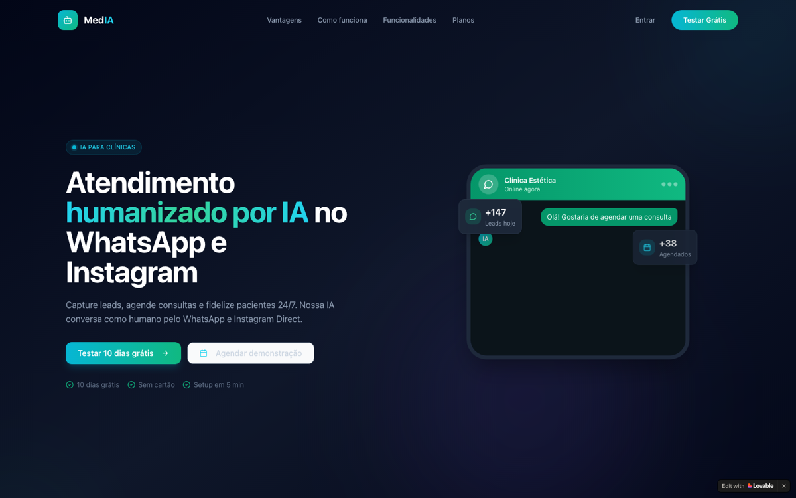

# Agenda Connect — clinical scheduling (vertical SaaS)

🇬🇧 English · [🇧🇷 Português](#-português)

**Role:** PM · Builder &nbsp;|&nbsp; **Status:** Live
🔗 [plan-n-joy.lovable.app](https://plan-n-joy.lovable.app)

### What it is
A **scheduling application for the healthcare sector**, built from a structured discovery of a market reference's feature set.

### Product decisions
- **Discovery by reverse engineering** — map a reference's features and flows before building; the discipline of not reinventing category standards.
- Focus on vertical healthcare SaaS (same domain as Assist4Doc → compounding learning).

### Pillar demonstrated
Ability to **decompose an existing product into requirements** and rebuild the core — specification and benchmarking competence.

---

## 🇧🇷 Português

**Papel:** PM · Builder &nbsp;|&nbsp; **Status:** No ar
🔗 [plan-n-joy.lovable.app](https://plan-n-joy.lovable.app)

### O que é
Uma **aplicação de agendamento para o setor de saúde**, construída a partir de um discovery estruturado do conjunto de funcionalidades de uma referência de mercado.

### Decisões de produto
- **Discovery por engenharia reversa** — mapear funcionalidades e fluxos de uma referência antes de construir; a disciplina de não reinventar padrões da categoria.
- Foco em SaaS vertical de saúde (mesmo domínio do Assist4Doc → aprendizado que se acumula).

### Pilar demonstrado
Capacidade de **decompor um produto existente em requisitos** e reconstruir o núcleo — competência de especificação e benchmark.
