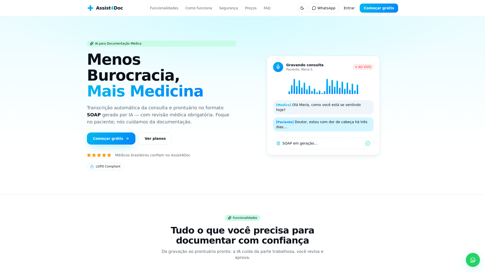

# Assist4Doc Site — SSR marketing surface

🇬🇧 English · [🇧🇷 Português](#-português)

**Role:** PM · Builder &nbsp;|&nbsp; **Related:** [Assist4Doc](assist4doc.md)

### The decision (this is the case)
The product app is optimised for a logged-in clinical workflow — great for users, weak for search engines. Instead of migrating the whole app to a server-rendered stack (high risk, low return), I **split off the marketing surface** into a separate server-rendered project sharing the same backend.

This is a classic PM call: **you migrate for user or business pain, not for novelty.** Server rendering only mattered for the public pages (SEO), so only the public pages moved — without touching a working, revenue-generating system.

### Delivered
- Conversion-oriented home + institutional pages (about, security, pricing, contact, terms, privacy).
- Real SEO: server rendering, per-page metadata, structured data, sitemap, machine-readable summary for AI crawlers.
- **Defensible compliance copy** — no unfounded numeric claims; a conscious advertising-law decision.

### Why it matters
Shows **architecture judgment under constraint**: knowing where new tech adds value (public SEO) and where it doesn't (the logged-in app), and designing a split that captures the upside without the migration risk.

---

## 🇧🇷 Português

**Papel:** PM · Builder &nbsp;|&nbsp; **Relacionado:** [Assist4Doc](assist4doc.md)

### A decisão (é esse o caso)
O app do produto é otimizado para o fluxo clínico logado — ótimo para o usuário, fraco para buscadores. Em vez de migrar o app inteiro para um stack com renderização no servidor (alto risco, baixo retorno), **separei a superfície de marketing** num projeto à parte, com renderização no servidor e o mesmo backend.

Decisão clássica de PM: **migra-se por dor de usuário ou de negócio, não por novidade.** Renderização no servidor só importava nas páginas públicas (SEO), então só elas migraram — sem tocar num sistema que funciona e gera receita.

### Entregue
- Home orientada a conversão + páginas institucionais (sobre, segurança, preços, contato, termos, privacidade).
- SEO de verdade: renderização no servidor, metadados por página, dados estruturados, sitemap, resumo legível por crawlers de IA.
- **Copy de compliance defensável** — sem claims numéricos sem lastro; decisão consciente de direito publicitário.

### Por que importa
Mostra **julgamento de arquitetura sob restrição**: saber onde a tecnologia nova agrega (SEO público) e onde não (o app logado), e desenhar um split que captura o ganho sem o risco da migração.
