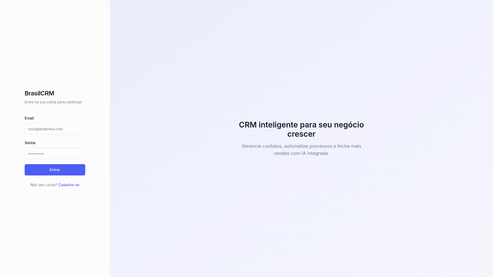

# ConversaFlow CRM — conversational CRM (Brazil)

🇬🇧 English · [🇧🇷 Português](#-português)

**Role:** Founder · PM · Builder &nbsp;|&nbsp; **Status:** Prototype (private)

### What it is
A conversational CRM aimed at the Brazilian SMB market: a **unified inbox** across messaging channels, a **Kanban sales pipeline**, **visual automation workflows** (triggers/actions), and team management with granular permissions and privacy-compliant auditing.

### Product decisions
- **Unified inbox** as the core — solving channel fragmentation for Brazilian SMBs.
- **Visual workflow builder** for no-code automation.
- **Privacy compliance** built in from the start (action auditing).

### Pillar demonstrated
Vision for a **complex B2B platform** (multi-channel, automation, role-based access) with a clear competitive read of the local market.

---

## 🇧🇷 Português

**Papel:** Founder · PM · Builder &nbsp;|&nbsp; **Status:** Protótipo (privado)

### O que é
Um CRM conversacional para o mercado de PMEs brasileiro: **caixa de entrada unificada** entre canais de mensagem, **funil Kanban**, **workflows visuais de automação** (gatilhos/ações) e gestão de equipes com permissões granulares e auditoria em conformidade com privacidade.

### Decisões de produto
- **Inbox unificada** como núcleo — resolvendo a fragmentação de canais da PME brasileira.
- **Construtor visual de workflow** para automação sem código.
- **Conformidade de privacidade** embutida desde o início (auditoria de ações).

### Pilar demonstrado
Visão de **plataforma B2B complexa** (multi-canal, automação, acesso por perfil) com leitura competitiva clara do mercado local.
