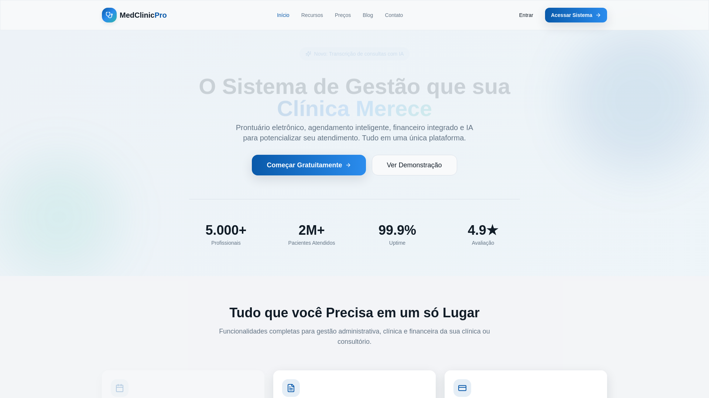

# Insight Health — full clinical system + content

🇬🇧 English · [🇧🇷 Português](#-português)

**Role:** Founder · PM · Builder &nbsp;|&nbsp; **Status:** Prototype (private)

### What it is
An integrated system for the medical sector: operational back office, electronic health record, admin panel, institutional pages, and a **content blog built to rank on search**. Scoped from a comparative study of leading national and international clinical systems.

### Product decisions
- **Broad scope mapped by benchmark** — smart scheduling, billing, clinical decision support, patient engagement, interoperability.
- **Content/SEO as a channel** from day one — organic acquisition built into the product.

### Pillar demonstrated
**Platform-scope thinking** in a complex domain (health) + content-led acquisition — product × growth combined.

---

## 🇧🇷 Português

**Papel:** Founder · PM · Builder &nbsp;|&nbsp; **Status:** Protótipo (privado)

### O que é
Um sistema integrado para o setor médico: back office operacional, prontuário eletrônico, painel admin, páginas institucionais e um **blog de conteúdo feito para ranquear na busca**. Escopo definido a partir de um estudo comparativo de sistemas clínicos nacionais e internacionais de referência.

### Decisões de produto
- **Escopo amplo mapeado por benchmark** — agenda inteligente, faturamento, suporte à decisão clínica, engajamento do paciente, interoperabilidade.
- **Conteúdo/SEO como canal** desde o dia um — aquisição orgânica embutida no produto.

### Pilar demonstrado
**Pensamento de escopo de plataforma** em domínio complexo (saúde) + aquisição por conteúdo — produto × growth combinados.
