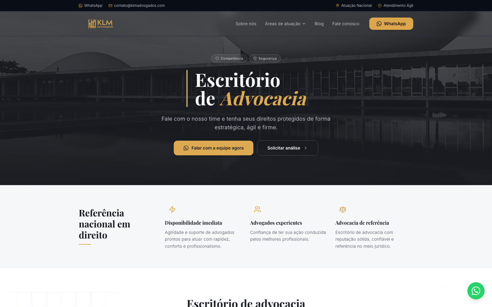

# KLM Legal Hub — case management + awareness

🇬🇧 English · [🇧🇷 Português](#-português)

**Role:** Founder · PM · Builder &nbsp;|&nbsp; **Status:** Live
🔗 [klmadvogados.com](https://klmadvogados.com)

### What it is
A **labor-law case management** platform (Kanban, lists, reports, approval queue) paired with an awareness landing page about financial fraud.

### Product decisions
- **Two jobs in one product:** internal case operations + acquisition/education — architected to integrate with a backend automation layer later.
- **Kanban as the operational backbone** for litigation flow.

### Innovation lens
**Horizon 1 on the law firm's own operation.** Standalone product for KLM Advogados: standardize case management around a Kanban backbone and turn the firm's brand surface into an awareness channel. Pre-AI in production today; AI integration on the roadmap, but not what this case is about.

### Product / Engineering decisions
| Decision | What I chose | Why |
|---|---|---|
| **Kanban as the operational spine** | State lives in Kanban; approval queue drives review | Lawyers already think in case stages — model the existing mental model |
| **Two jobs in one product** | Internal case management + public awareness landing | Acquisition lives where domain expertise is visible |
| **FastAPI + WebSockets ready** | Backend modeled for real-time events, not a static dashboard | When AI features are added, the loop is already there |
| **Component library shadcn/ui** | Production speed without UX debt | Craft and velocity in the same combo |

> **Not to be confused with Lastro.** KLM Legal Hub is the law firm's own internal/public product (klmadvogados.com). **Lastro** is a separate AI-native legal platform with multi-AI panel and verified RAG — see [its own case](lastro.md).

### Pillar demonstrated
Legaltech applied to my own home domain (law) — a product built by someone who feels the user's pain from the inside.

---

## 🇧🇷 Português

**Papel:** Founder · PM · Builder &nbsp;|&nbsp; **Status:** No ar
🔗 [klmadvogados.com](https://klmadvogados.com)

### O que é
Plataforma de **gestão de casos trabalhistas** (Kanban, listas, relatórios, fila de aprovação) somada a uma landing de conscientização sobre fraude financeira.

### Decisões de produto
- **Dois jobs num produto:** operação interna de casos + aquisição/educação — arquitetado para integrar com uma camada de automação no backend depois.
- **Kanban como espinha dorsal operacional** do contencioso.

### Innovation lens
**Horizonte 1 sobre a operação da própria banca.** Produto standalone do KLM Advogados: padronizar gestão de casos em torno de uma espinha Kanban e usar a marca como canal de conscientização. Hoje pré-IA em produção; integração com IA está no roadmap, mas não é o foco deste caso.

### Decisões de produto / engenharia
| Decisão | O que escolhi | Por quê |
|---|---|---|
| **Kanban como espinha operacional** | Estado vive no Kanban; fila de aprovação dirige revisão | Advogado já pensa em fase de caso — modelar o modelo mental existente |
| **Dois jobs num produto só** | Gestão interna + landing pública de conscientização | Aquisição mora onde a expertise é visível |
| **FastAPI + WebSockets prontos** | Backend modelado para evento real-time, não dashboard estático | Quando features de IA entrarem, o loop já existe |
| **Biblioteca shadcn/ui** | Velocidade de produção sem dívida de UX | Craft e velocidade na mesma combinação |

> **Não confundir com Lastro.** KLM Legal Hub é o produto próprio da banca (klmadvogados.com). **Lastro** é uma plataforma jurídica AI-native separada, com painel multi-IA e RAG verificado — ver [caso próprio](lastro.md).

### Pilar demonstrado
Legaltech aplicada ao meu próprio domínio de origem (Direito) — produto construído por quem sente a dor do usuário por dentro.
