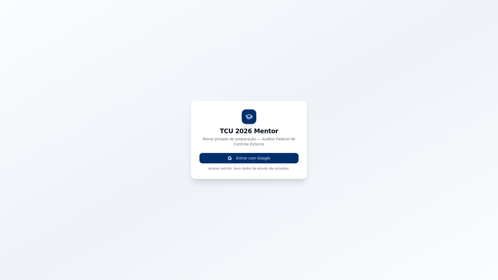

# TCU 2026 Navigator — data-driven exam prep with AI

🇬🇧 English · [🇧🇷 Português](#-português)

**Role:** PM · Builder &nbsp;|&nbsp; **Status:** Live (private)

### Problem
Preparing for a high-stakes public exam needs **direction from data**, not brute force: where the errors are, which sub-topics pay off most, how to stay consistent.

### Solution
A private dashboard: hours studied, accuracy, countdown, daily tracker, question log, mock-exam records, AI essay feedback, sub-topic checklist, calendar.

### Product decision
- **Priorization by incidence (Pareto 80/20)** — the app focuses effort on what actually shows up most in the exam.
- **AI as a tutor for essay feedback**, not a generator — feedback, not substitution.

### Takeaway
Small but telling: I **use my own products** and apply data-driven priorization even to studying. Real dogfooding.

---

## 🇧🇷 Português

**Papel:** PM · Builder &nbsp;|&nbsp; **Status:** No ar (privado)

### Problema
Preparar-se para um concurso de alta exigência precisa de **direção a partir de dados**, não força bruta: onde estão os erros, quais subtópicos rendem mais, como manter consistência.

### Solução
Um dashboard privado: horas estudadas, acerto, contagem regressiva, tracker diário, log de questões, registro de simulados, feedback de redação por IA, checklist de subtópicos, calendário.

### Decisão de produto
- **Priorização por incidência (Pareto 80/20)** — o app foca o esforço no que mais cai na prova.
- **IA como tutor de redação**, não gerador — feedback, não substituição.

### Aprendizado
Pequeno mas ilustrativo: eu **uso meus próprios produtos** e aplico priorização orientada a dados até no estudo. Dogfooding real.
